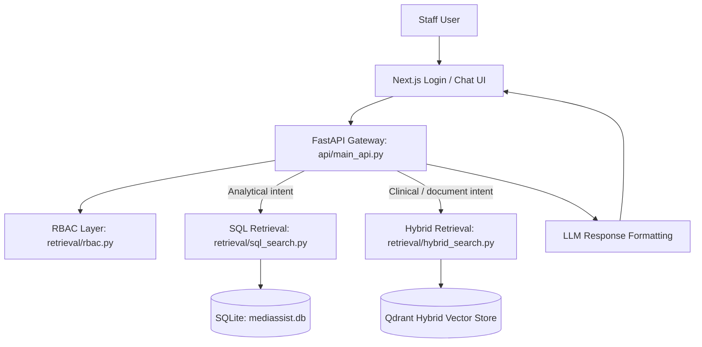
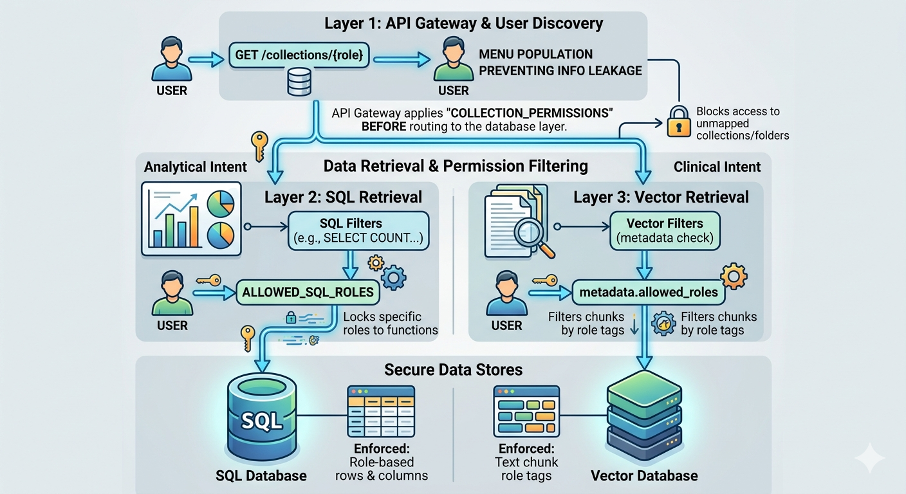

# MediBot Assignment Resources

## Overview

MediBot is an enterprise-grade Retrieval-Augmented Generation (RAG) system developed for MediAssist Health Network to provide secure, role-aware access to internal healthcare knowledge.

Healthcare organizations manage large volumes of unstructured documents including treatment protocols, drug formularies, nursing procedures, billing guides, hospital policies, and equipment manuals. Traditional keyword-based search often results in poor retrieval quality, while unrestricted access creates significant security and compliance risks.

MediBot addresses these challenges through:

- Advanced Hybrid Retrieval (Dense + BM25 Search)
- Reranking for improved relevance
- Role-Based Access Control (RBAC) enforced at the retrieval layer
- FastAPI backend services
- Next.js frontend interface
- Source-aware responses with document citations

The system ensures users can access only the information permitted for their role while receiving highly relevant answers grounded in organizational knowledge.

## What This Project Does

- Role-based login for healthcare staff
- Intent-aware routing between SQL analytics and document retrieval
- Role-constrained answers grounded in authorized internal content
- Source-aware responses with document references
- Responsive chat UI with fixed viewport and scrollable conversation history

## Architecture



The request flow is intentionally layered:

1. The UI sends a question to the FastAPI gateway.
2. The gateway applies role and intent checks before any retrieval happens.
3. SQL queries are limited to billing executive and admin.
4. Clinical/document retrieval is filtered by collection permissions and chunk metadata.
5. The final answer is returned to the UI with a consistent chat presentation.

## Role Matrix

| Role | Department | Accessible Collections |
|---|---|---|
| `doctor` | Clinical | Clinical protocols, drug formulary, diagnostic guidelines + General |
| `nurse` | Clinical | Nursing procedures, patient care guidelines + General |
| `billing_executive` | Billing & Insurance | Insurance billing codes, claim procedures, billing FAQs + General |
| `technician` | Medical Equipment | Equipment manuals, calibration guides, maintenance schedules + General |
| `admin` | Executive / IT | All document collections |

## Screenshots

### Login Page


The login screen is intentionally minimal: project branding, username/password fields, and a single action button. It validates credentials against the backend login endpoint and then initializes a role-scoped session.

Sample login credentials (testing/demo):

| Username | Password | Role |
|---|---|---|
| `admin_user` | `password123` | `admin` |
| `doctor_user` | `password123` | `doctor` |
| `nurse_user` | `password123` | `nurse` |
| `billing_user` | `password123` | `billing_executive` |
| `tech_user` | `password123` | `technician` |

### Chat Page


The chat page shows the active user, user type, and role-specific accessible collections. Access permissions are enforced in the backend retrieval layer, so users can only retrieve content allowed for their role.

The exact collection permissions follow the Role Matrix above and are enforced server-side at retrieval time.

### Security Boundary Diagram


This diagram highlights the trust boundaries across the system: user-facing UI, API gateway, retrieval services, and storage layers. It emphasizes that authentication and role context enter through the API boundary, and every downstream component must respect RBAC decisions before any document snippets or SQL results are returned.

### Retrieval Architecture Diagram



This architecture diagram illustrates the hybrid retrieval flow: query understanding, role-aware filtering, vector/keyword retrieval, and final response synthesis. It also shows how structured SQL retrieval and unstructured document retrieval are combined so users receive accurate answers while remaining within their permitted data scope.

## Key Files

- [api/main_api.py](api/main_api.py) - API gateway, login, routing, and RBAC enforcement
- [retrieval/rbac.py](retrieval/rbac.py) - role and collection permissions
- [retrieval/hybrid_search.py](retrieval/hybrid_search.py) - hybrid retrieval and answer generation
- [retrieval/sql_search.py](retrieval/sql_search.py) - SQL generation and result formatting
- [ui/src/app/page.tsx](ui/src/app/page.tsx) - login and chat frontend
- [ui/src/app/globals.css](ui/src/app/globals.css) - full-screen UI layout and scroll styling

## Running the App

### Backend

```bash
python -m uvicorn api.main_api:app --host 127.0.0.1 --port 8002
```

### Frontend

```bash
cd ui
npm install
npm run dev
```

## Notes

- The conversation area is fixed-height and scrollable inside the chat panel.
- The app is designed so the page itself does not scroll while the message history does.
- Debug log files were removed from the repository root to keep the workspace clean.